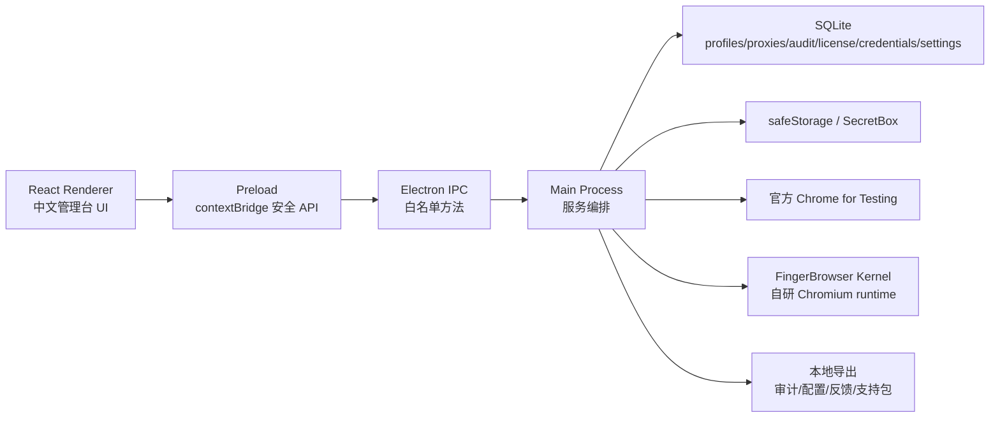

# 指纹浏览器技术规格文档

版本：0.1.0  
日期：2026-04-30  
适用仓库：`fingerbrowser`  
目标平台：macOS arm64 优先

## 1. 产品定位

指纹浏览器是一个面向合规运营团队的本地桌面端环境资产管理工具。它用于管理隔离的 Chromium 浏览器环境、代理配置、可审计的隐私归一化策略、本地密码库、授权试卖闭环和自研 Chromium 内核运行通道。

项目明确不提供平台绕过、随机指纹噪声、验证码绕过、账号批量自动化、批量行为同步或风控规避能力。当前策略聚焦稳定、可解释、可审计的一致性归一化。

## 2. 技术栈

| 层级 | 技术 |
| --- | --- |
| 桌面容器 | Electron 41 |
| 构建框架 | electron-vite、Vite 6 |
| 前端 | React 18、TypeScript、CSS |
| 主进程 | Node.js、TypeScript |
| 本地数据库 | SQLite via `better-sqlite3` |
| 加密 | Electron `safeStorage`，E2E/不可用时使用 Node fallback |
| 浏览器运行时 | Chrome for Testing 官方通道、自研 Chromium 内核通道 |
| 图标 | lucide-react |
| 单元测试 | Vitest |
| E2E | Playwright |
| 打包 | electron-builder mac dir target |

## 3. 总体架构



主进程负责所有持久化、加密、浏览器启动、文件导出和系统剪贴板操作。Renderer 只通过 preload 暴露的 `window.fingerBrowser` API 访问功能，不直接访问 Node.js、数据库或文件系统。

## 4. 目录结构

| 路径 | 说明 |
| --- | --- |
| `src/main/index.ts` | Electron 窗口创建和 IPC 注册入口 |
| `src/main/ipc.ts` | IPC handler 白名单与服务调用编排 |
| `src/main/services.ts` | 应用服务初始化、数据库、加密、运行时管理器装配 |
| `src/main/domain/*` | 领域服务：环境、代理、内核、授权、试卖、密码库等 |
| `src/main/infrastructure/*` | SQLite、Chromium 安装器、外部浏览器控制器 |
| `src/preload/index.ts` | 安全暴露 `AppApi` |
| `src/shared/*` | 前后端共享类型、默认策略、时区选项 |
| `src/renderer/src/App.tsx` | 主 UI：环境列表、详情抽屉、密码库工作台 |
| `src/renderer/src/credential-vault.ts` | 密码库菜单、过滤、最近复制 helper |
| `src/renderer/src/password-generator.ts` | 前端安全随机密码生成器 |
| `scripts/*` | 激活码签发、试卖 release、内核调试启动脚本 |
| `tests/*` | 单元测试 |
| `e2e/app.spec.ts` | 端到端中文 UI 主流程 |

## 5. 数据模型

数据库文件默认位于 Electron `userData/data/fingerbrowser.sqlite`，测试可通过 `FINGERBROWSER_DATA_DIR` 指定。数据库开启 WAL。

### 5.1 profiles

保存浏览器环境：

- `id`
- `name`
- `tags_json`
- `status`: `closed | running | error`
- `user_data_dir`
- `chromium_version`
- `runtime_channel`: `official | custom-kernel`
- `fingerprint_policy_json`
- `proxy_id`
- `created_at`
- `updated_at`

### 5.2 proxies

保存代理配置：

- `id`
- `scheme`: `http | https | socks5`
- `host`
- `port`
- `username`
- `encrypted_password`
- `bypass_list_json`
- `last_test_status`
- `created_at`
- `updated_at`

代理密码只保存加密串。审计、导出、反馈包不得出现明文密码。

### 5.3 audit_events

保存本地审计：

- `id`
- `profile_id`
- `action`
- `actor = local-user`
- `metadata_json`
- `created_at`

审计 metadata 不记录代理密码、密码库明文、license token、Cookie/cache 内容。

### 5.4 credentials

全局密码库，支持可选绑定一个环境：

- `id`
- `profile_id` 可空
- `title`
- `website_url`
- `username`
- `encrypted_password`
- `created_at`
- `updated_at`
- `last_copied_at`

旧表 `profile_credentials` 仍保留，启动时幂等迁移到 `credentials`，不删除旧表。

### 5.5 license_cache

保存本地授权缓存：

- `team_name`
- `plan_json`
- `device_id`
- `encrypted_activation_token`
- `activated_at`
- `expires_at`
- `last_checked_at`

激活 token 加密保存；对外状态使用 redacted 结构。

### 5.6 trial_metrics / onboarding_state / app_settings

- `trial_metrics`: 本地试卖指标计数。
- `onboarding_state`: 试卖清单收起状态。
- `app_settings`: 当前保存 `kernelManifestPath`、`kernelManifestImportedAt`。

## 6. 核心模块规格

### 6.1 环境管理

环境由 `ProfileService` 管理，支持创建、更新、列表、启动、关闭和审计。每个环境拥有独立 `userDataDir`，用于保留 Cookie、缓存和登录态。

创建和更新时会归一化：

- 名称非空校验
- 标签去重和 trim
- 时区通过 `Intl.DateTimeFormat(...).resolvedOptions().timeZone` 校验
- runtime channel 默认 `official`
- 窗口尺寸、语言、权限、WebRTC 策略使用默认值合并

默认策略：

- `locale = zh-CN`
- `timezone = Asia/Shanghai`
- `windowSize = 1360x900`
- `permissionDefaults = deny`
- `webrtcIpPolicy = disable_non_proxied_udp`

### 6.2 浏览器运行时

支持两个通道：

| 通道 | 说明 |
| --- | --- |
| `official` | 使用 `@puppeteer/browsers` 安装和启动 Chrome for Testing stable |
| `custom-kernel` | 使用本地导入或环境变量指定的自研内核 manifest |

启动参数由 `buildChromiumLaunchPlan` 生成：

- `--user-data-dir`
- `--lang`
- `--window-size`
- `--no-first-run`
- `--no-default-browser-check`
- `--disable-features=Translate,OptimizationHints`
- `--force-webrtc-ip-handling-policy`
- `--deny-permission-prompts`
- 代理相关 `--proxy-server` / `--proxy-bypass-list`
- 代理认证 MV3 扩展 `--load-extension`
- custom kernel 专用 `--fingerbrowser-policy=<path>`

启动时额外设置进程环境变量 `TZ=<profile timezone>`，并默认打开本地环境自检页。

### 6.3 自研内核通道

桌面端只消费内核产物，不包含 Chromium 源码或二进制。内核 manifest 结构：

- `version`
- `baseChromiumRevision`
- `patchsetVersion`
- `platform = darwin`
- `arch = arm64`
- `artifactUrl`
- `sha256`
- `executableRelativePath`
- `policySchemaVersion`

manifest 来源优先级：

1. 应用内导入 manifest，持久化在 `app_settings`
2. 环境变量 `FINGERBROWSER_KERNEL_MANIFEST`
3. 内置默认 manifest

custom kernel 未安装或校验失败时不会静默回退到 official。`file://` zip 会先校验 sha256，再用 `ditto` 解包。

自研内核策略文件：

```json
{
  "schemaVersion": 1,
  "profileId": "...",
  "runtimeChannel": "custom-kernel",
  "fingerprintPolicy": {
    "locale": "zh-CN",
    "timezone": "America/Los_Angeles",
    "windowSize": { "width": 1360, "height": 900 },
    "permissionDefaults": "deny",
    "webrtcIpPolicy": "disable_non_proxied_udp"
  }
}
```

策略文件写入环境 `userDataDir/fingerbrowser_policy.json`，文件权限 `0600`。

### 6.4 环境自检页

启动浏览器时生成本地自检页，默认作为起始 URL 打开。自检页用于展示：

- 语言
- JS 时区
- 目标时区
- IP 时区
- 时区一致性
- 浏览器窗口尺寸
- WebRTC 策略提示

页面通过浏览器网络访问公开 IP Geo 服务来检测代理出口信息。该页面不读取本地 profile Cookie/cache，也不包含代理密码、license token 或本地敏感路径。

### 6.5 代理管理与时区匹配

代理支持：

- HTTP
- HTTPS
- SOCKS5

代理基础校验：

- scheme 必须在支持列表内
- host 非空
- port 为 1 到 65535 的整数

代理测试先进行 TCP 连通性检测。HTTP/HTTPS 代理会进一步通过代理请求 IP Geo 服务，返回：

- 出口 IP
- IP 时区
- 国家/地区/城市
- `timezoneMatch`

UI 提供“根据代理匹配时区”按钮：根据代理出口 IP 时区自动更新当前环境时区，并保存到 profile。当前预启动智能匹配主要覆盖 HTTP/HTTPS 代理；SOCKS5 代理仍可通过启动后的自检页观察出口时区一致性。

### 6.6 密码库

密码库为独立工作台，采用主菜单“密码库”入口。内部三栏：

- 左栏：全部密码、未绑定环境、已绑定环境、最近复制、按环境分组
- 中栏：搜索、计数、列表
- 右栏：详情、编辑、新增

密码项可全局保存，也可绑定一个环境。环境详情里的“密码”Tab 只显示当前环境绑定的密码。

安全规则：

- 密码保存时在主进程加密。
- 复制密码由主进程解密并写入系统剪贴板。
- 列表接口不返回明文密码或加密串。
- 用户主动点击查看密码时，主进程通过 `credentials.revealPassword` 返回明文给 Renderer 展示，并写入 `CREDENTIAL_PASSWORD_REVEALED` 审计。
- 未激活、过期 license 会拦截新增、编辑、删除、复制和查看。

### 6.7 密码生成器

密码生成器为纯前端 helper，不新增 IPC、不落库、不写日志。

规则：

- 默认长度 20
- 长度范围 12 到 64
- 小写必选
- 可选大写、数字、符号
- 使用 `crypto.getRandomValues`
- 每个启用字符集至少出现一个字符
- 使用拒绝采样避免 modulo bias

生成结果只临时填入表单，保存仍走主进程加密流程。

### 6.8 授权与套餐限制

授权采用人工销售签发激活码，本地校验签名并缓存。

激活码格式：

```text
FBLC1.<base64url payload>.<base64url hmac-sha256 signature>
```

默认套餐：

| 套餐 | 席位 | 环境数 | 支持等级 |
| --- | --- | --- | --- |
| 试用版 | 1 | 5 | community |
| 专业版 | 1 | 50 | standard |
| 团队版 | 3 | 200 | priority |

状态：

- `inactive`
- `active`
- `grace`
- `expired`

过期后有 2 天 grace。创建环境和密码库能力受 license 限制。

### 6.9 试卖闭环

试卖模块包含：

- 试卖清单
- 本地指标
- 反馈包
- 支持日志包
- 审计导出
- 配置导出
- 版本中心
- GitHub Release 手动检查更新

指标仅本地累计，不自动上传。反馈包和支持包使用脱敏导出，不包含明文密码、加密串、license token、Cookie/cache 内容。

### 6.10 发布与打包

常用脚本：

- `npm run dev`
- `npm run dev:kernel`
- `npm run build`
- `npm run package:mac`
- `npm run release:trial`
- `npm run release:trial:publish`
- `npm run license:issue`

`package:mac` 生成 `release/mac-arm64` 目录包，当前 `identity = null`，为未签名调试包。外部分发前必须补充 Developer ID 签名和 notarization。

`release:trial` 会生成：

- `fingerbrowser-v<version>-mac-arm64-trial.zip`
- `checksums.txt`
- `release-notes.md`

## 7. IPC 合约

Renderer 只能通过 `window.fingerBrowser` 访问主进程。

| 分组 | 方法 |
| --- | --- |
| `profiles` | `list`、`create`、`bulkCreate`、`update`、`export`、`launch`、`stop` |
| `proxy` | `test`、`testAll` |
| `audit` | `list`、`export` |
| `chromium` | `ensureInstalled` |
| `kernel` | `manifest`、`status`、`ensureInstalled`、`importManifest`、`clearManifest`、`openRuntimeFolder` |
| `app` | `version` |
| `release` | `checkForUpdates`、`openLatestRelease` |
| `onboarding` | `status`、`dismiss`、`reset` |
| `trial` | `metrics` |
| `feedback` | `package` |
| `credentials` | `list`、`create`、`update`、`delete`、`copyUsername`、`copyPassword`、`revealPassword` |
| `license` | `activate`、`status`、`refresh`、`deactivate`、`usage` |
| `support` | `packageLogs` |

## 8. 安全规格

### 8.1 Electron 安全

- `contextIsolation = true`
- `nodeIntegration = false`
- Renderer 不直接接触 Node.js API
- 外部链接通过 `shell.openExternal`
- IPC 使用显式白名单

当前窗口配置中 `sandbox = false`，原因是 preload 和 Electron 桌面能力仍在使用常规 Electron 模式。后续如要强化安全，可评估改造为 sandbox preload。

### 8.2 敏感数据处理

| 数据 | 处理方式 |
| --- | --- |
| 代理密码 | 主进程加密保存，启动/测试时解密使用 |
| 密码库密码 | 主进程加密保存，复制/查看时按用户动作解密 |
| license token | 加密保存，对外 redacted |
| profile Cookie/cache | 不进入导出、反馈包、支持日志 |
| 内核 policy | 只包含稳定策略，不包含密码、token、cookie/cache |

### 8.3 审计

关键动作写入本地审计，包括环境、代理、授权、内核、密码库、导出、更新检查和反馈包。审计 metadata 保持最小化，避免敏感字段。

## 9. 测试规格

当前测试命令：

```bash
npm run typecheck
npm run lint
npm test
npm run build
npm run e2e
npm run package:mac
```

单元测试覆盖：

- license 签名、状态、套餐限制
- profile 校验和时区归一化
- proxy 校验、连通、出口时区一致性
- kernel manifest、policy、安装校验
- credential 加密、复制、查看、绑定筛选
- password generator
- trial metrics、feedback、release
- security redaction

E2E 覆盖中文 UI 主流程：

- 激活 license
- 新建环境
- 配置代理并测试
- 根据代理匹配时区
- 启动/关闭 official 和 custom-kernel 环境
- 密码库操作
- 审计、反馈、上限拦截

## 10. 运行环境与配置

| 环境变量 | 说明 |
| --- | --- |
| `FINGERBROWSER_DATA_DIR` | 指定本地数据目录 |
| `FINGERBROWSER_E2E=1` | 启用 E2E mock 安装器和 mock 内核 |
| `FINGERBROWSER_LICENSE_SIGNING_SECRET` | 激活码签名密钥 |
| `FINGERBROWSER_KERNEL_MANIFEST` | 指定自研内核 manifest |
| `ELECTRON_RENDERER_URL` | electron-vite dev renderer URL |
| `ELECTRON_MIRROR` | Electron 下载镜像 |

## 11. 当前限制

- 首版仅面向 macOS arm64。
- 当前 mac 包未签名、未公证，只适合内部调试。
- 自研内核源码和构建链路在独立 `fingerbrowser-kernel` 仓库。
- 自研内核安装以 manifest 导入和本地 zip/file 产物为主，不做自动更新。
- 版本中心只手动检查 GitHub Release，不自动下载安装。
- 授权服务为人工签发激活码和本地校验，尚未接入在线 license 服务。
- 代理出口时区预检测主要支持 HTTP/HTTPS；SOCKS5 的一致性观察依赖启动后的浏览器自检页。
- 密码库支持用户主动查看明文密码；这是显式用户动作，应保留审计并避免进入导出/日志。

## 12. 后续技术演进建议

1. 补齐 SOCKS5 代理出口 IP Geo 查询，用于预启动时区自动匹配。
2. 将 Electron `sandbox` 改造纳入安全加固计划。
3. 增加数据库 schema version 和显式迁移框架，替代散落的兼容逻辑。
4. 引入真实在线 license 服务，支持设备绑定、解绑、续期和服务端状态刷新。
5. 增加 signed/notarized macOS 发布流水线。
6. 自研内核增加可复现构建记录、产物签名和策略生效自动验证。
7. 密码查看可增加短时显示、自动隐藏、剪贴板自动清空等安全增强。
8. 反馈包增加更细粒度的用户可选项，让客户明确知道每类诊断内容。
